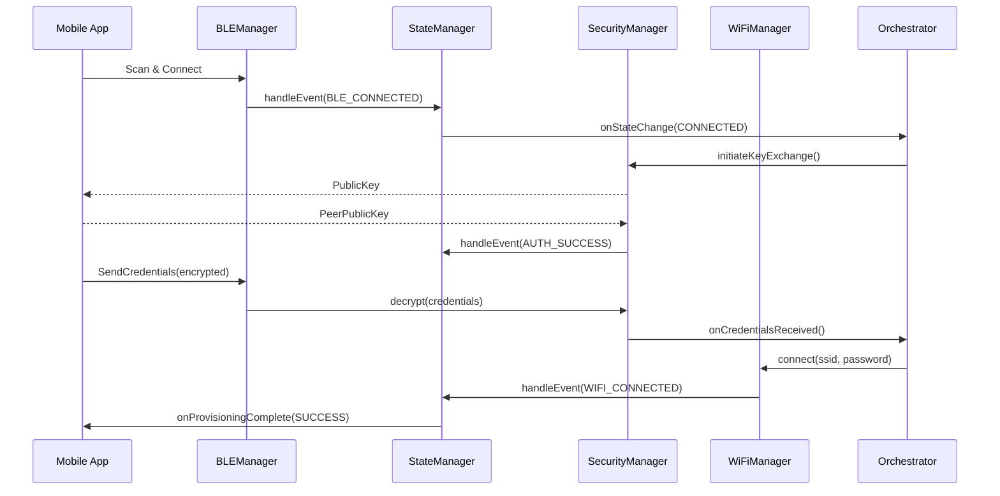

# WiBLE - Advanced BLE Provisioning Library
## Architecture & Implementation Guide v2.0

---

## Table of Contents

1. [Architecture Overview](#architecture-overview)
2. [Core Components](#core-components)
3. [Design Patterns Used](#design-patterns-used)
4. [Security Architecture](#security-architecture)
5. [Error Handling Strategy](#error-handling-strategy)
6. [Testing Strategy](#testing-strategy)
7. [Performance Optimization](#performance-optimization)
8. [Platform Considerations](#platform-considerations)
9. [Migration from Simple Library](#migration-from-simple-library)

---

## Architecture Overview

### Five-Layer Architecture

```
┌─────────────────────────────────────────────────────┐
│         Application Interface Layer (WiBLE.h)       │
│  Simple facade API hiding internal complexity       │
└─────────────────────────────────────────────────────┘
                        ▼
┌─────────────────────────────────────────────────────┐
│              Core Services Layer                     │
│  ┌──────────────┐  ┌──────────────┐                │
│  │ StateManager │  │  Security    │                │
│  │     (FSM)    │  │   Manager    │                │
│  └──────────────┘  └──────────────┘                │
│  ┌──────────────┐  ┌──────────────┐                │
│  │ Provisioning │  │   Storage    │                │
│  │ Orchestrator │  │   Manager    │                │
│  └──────────────┘  └──────────────┘                │
└─────────────────────────────────────────────────────┘
                        ▼
┌─────────────────────────────────────────────────────┐
│              Protocol Layer                          │
│  ┌──────────────┐  ┌──────────────┐                │
│  │ BLEManager   │  │ WiFiManager  │                │
│  │ (GATT/GAP)   │  │ (Connection) │                │
│  └──────────────┘  └──────────────┘                │
│  ┌──────────────┐  ┌──────────────┐                │
│  │  Data        │  │   Error      │                │
│  │ Serializer   │  │  Handler     │                │
│  └──────────────┘  └──────────────┘                │
└─────────────────────────────────────────────────────┘
                        ▼
┌─────────────────────────────────────────────────────┐
│       Platform Abstraction Layer                    │
│  ESP32 BLE Stack  │  ESP32 WiFi Stack               │
└─────────────────────────────────────────────────────┘
                        ▼
┌─────────────────────────────────────────────────────┐
│          Cross-Cutting Concerns                     │
│  Logging  │  Metrics  │  Config  │  Events          │
└─────────────────────────────────────────────────────┘
```

### Component Interactions



---

## Core Components

### 1. **WiBLE (Main Class)**
- **Purpose**: Unified API facade
- **Responsibilities**:
  - Lifecycle management (begin/loop/end)
  - Component coordination
  - Callback routing
  - Configuration management

**Key Methods**:
```cpp
bool begin(const ProvisioningConfig& config);
void loop();  // State machine tick, operation queue processing
bool startProvisioning();
Result<bool> provisionManually(credentials);
```

### 2. **StateManager (FSM)**
- **Purpose**: Predictable state transitions
- **States**:
  - IDLE → BLE_ADVERTISING → BLE_CONNECTED → AUTHENTICATING
  - → RECEIVING_CREDENTIALS → CONNECTING_WIFI → VALIDATING
  - → PROVISIONED / ERROR

**Benefits**:
- No race conditions
- Clear state history
- Timeout handling per state
- Guard conditions for transitions

### 3. **SecurityManager**
- **Purpose**: Cryptographic operations
- **Features**:
  - ECDH key exchange (Curve25519)
  - AES-256-CBC/GCM encryption
  - HMAC for message authentication
  - Secure credential storage (NVS with encryption)
  - Session management with expiry

**Security Flow**:
```
1. Generate ECDH keypair
2. Exchange public keys over BLE
3. Compute shared secret
4. Derive AES session key (HKDF)
5. Encrypt WiFi credentials
6. Transmit with IV + HMAC
7. Decrypt and verify on device
```

### 4. **BLEManager**
- **Purpose**: BLE connection lifecycle
- **Features**:
  - GATT service/characteristic management
  - MTU negotiation (up to 512 bytes)
  - Operation queue (serialized GATT ops)
  - Chunked data transfer
  - RSSI monitoring

**Critical Pattern**: Operation Serialization
```cpp
// NEVER do this (race conditions):
write(char1, data1);
write(char2, data2);

// ALWAYS do this:
enqueueOperation({WRITE, char1, data1});
enqueueOperation({WRITE, char2, data2});
processOperationQueue(); // Serialized execution
```

### 5. **WiFiManager**
- **Purpose**: WiFi connection with resilience
- **Features**:
  - Network scanning
  - Connection with exponential backoff retry
  - Auto-reconnect with circuit breaker
  - Multi-network priority list
  - Static IP / DHCP support
  - Connection quality monitoring

**Retry Strategy**:
```
Attempt 1: Immediate
Attempt 2: 2s delay
Attempt 3: 4s delay
Attempt 4: 8s delay
After 5 failures: Circuit open (5min cooldown)
```

### 6. **ProvisioningOrchestrator**
- **Purpose**: Coordinate multi-step provisioning
- **Responsibilities**:
  - Workflow sequencing
  - Progress tracking
  - Error recovery
  - Validation

**Provisioning Workflow**:
```cpp
1. Start BLE advertising
2. Wait for client connection
3. Perform authentication (ECDH)
4. Receive encrypted credentials
5. Validate credentials format
6. Connect to WiFi
7. Validate internet access
8. Persist credentials (encrypted)
9. Notify success
10. Transition to normal operation
```

---

## Design Patterns Used

### 1. **Facade Pattern**
```cpp
// Complex subsystems hidden behind simple API
WiBLE wible;
wible.begin(config);
wible.startProvisioning(); // Internally coordinates 5+ components
```

### 2. **State Pattern (FSM)**
```cpp
// Each state encapsulates behavior
class IdleState : public State {
    void onEnter() { stopBLE(); }
    void onEvent(START_ADVERTISING) { transition(AdvertisingState); }
};
```

### 3. **Observer Pattern**
```cpp
// Components notify through callbacks
wible.onStateChange([](oldState, newState) {
    Serial.println("State changed!");
});
```

### 4. **Strategy Pattern**
```cpp
// Pluggable security levels
class SecurityStrategy {
    virtual EncryptedMessage encrypt(data) = 0;
};

class AES256Strategy : public SecurityStrategy { ... };
class BasicStrategy : public SecurityStrategy { ... };
```

### 5. **Factory Pattern**
```cpp
// Create appropriate implementations
class BLEAdapterFactory {
    static BLEAdapter* create(Platform platform) {
        if (platform == ESP32) return new ESP32BLEAdapter();
        if (platform == NRF52) return new NRF52BLEAdapter();
    }
};
```

### 6. **PIMPL (Pointer to Implementation)**
```cpp
// Hide implementation details
class WiBLE {
    std::unique_ptr<WiBLEImpl> impl; // Forward declaration
};
```

### 7. **Circuit Breaker**
```cpp
class CircuitBreaker {
    if (failureCount > threshold) {
        state = OPEN;
        return Error("Circuit open");
    }
};
```

---

## Security Architecture

### Threat Model

**Threats**:
1. Man-in-the-Middle (MITM) during BLE pairing
2. Credential sniffing over BLE
3. Replay attacks
4. Device impersonation
5. Stored credential theft

**Mitigations**:
1. ECDH key exchange (prevents MITM)
2. AES-256 encryption (prevents sniffing)
3. Nonces + timestamps (prevents replay)
4. Device authentication (prevents impersonation)
5. NVS encryption (protects storage)

### Security Levels

| Level | Pairing | Encryption | Use Case |
|-------|---------|-----------|----------|
| NONE | Just Works | None | Dev only |
| BASIC | PIN | AES-128-ECB | Hobbyist |
| SECURE | Numeric Comparison | AES-256-CBC + ECDH | Production |
| ENTERPRISE | Certificate Pinning | AES-256-GCM + ECDH | Industrial |

### Key Derivation

```
Shared Secret (ECDH) 
    ↓ HKDF
Session Key (256-bit)
    ↓ Split
Encryption Key (128-bit) | HMAC Key (128-bit)
```

### Credential Flow

```
Mobile App                      ESP32 Device
    ↓                               ↓
1. Generate ECDH keypair    ←   Generate ECDH keypair
2. Exchange public keys     →   Compute shared secret
3. Compute shared secret    ←   Derive session key
4. Derive session key
    ↓
5. Encrypt WiFi credentials
   - Plaintext: {"ssid":"X","pwd":"Y"}
   - AES-256-CBC with random IV
   - Compute HMAC
    ↓
6. Transmit: IV + Ciphertext + HMAC  →
                                    ↓
                            7. Verify HMAC
                            8. Decrypt with session key
                            9. Extract credentials
                            10. Connect to WiFi
```

---

## Error Handling Strategy

### Error Taxonomy

```cpp
sealed class ProvisioningError {
    // Connection errors (retry with backoff)
    DeviceNotFound
    ConnectionFailed
    ConnectionLost
    
    // Authentication errors (require user action)
    PairingFailed
    AuthenticationTimeout
    
    // Provisioning errors (validate input)
    InvalidCredentials
    WiFiConnectionFailed
    
    // System errors (check prerequisites)
    BluetoothDisabled
    InsufficientPermissions
}
```

### Retry Decision Tree

```
Error Occurred
    ↓
Is Transient? (network glitch, timeout)
    Yes → Retry with exponential backoff
    No → Is User Recoverable?
        Yes → Prompt user (wrong password, enable BT)
        No → Fatal error, log and exit
```

### Circuit Breaker States

```
CLOSED (normal)
    ↓ (5 consecutive failures)
OPEN (fail fast)
    ↓ (after 60s timeout)
HALF_OPEN (try one request)
    ↓ Success → CLOSED
    ↓ Failure → OPEN
```

---

## Testing Strategy

### Test Pyramid

```
        E2E Tests (10%)
       /               \
      /  Integration   \
     /    Tests (20%)   \
    /                    \
   /   Unit Tests (70%)  \
  -------------------------
```

### Unit Tests (70%)

**What to test**:
- State machine transitions
- Encryption/decryption
- Data serialization
- Retry logic
- Timeout handling

**Example**:
```cpp
TEST(StateManager, TransitionFromIdleToAdvertising) {
    StateManager sm;
    sm.initialize();
    EXPECT_EQ(sm.getCurrentState(), IDLE);
    
    bool transitioned = sm.handleEvent(START_ADVERTISING);
    EXPECT_TRUE(transitioned);
    EXPECT_EQ(sm.getCurrentState(), BLE_ADVERTISING);
}
```

### Integration Tests (20%)

**What to test**:
- BLE Manager + State Manager
- Security Manager + BLE Manager
- WiFi Manager + Orchestrator
- Full provisioning flow (with mocks)

**Example**:
```cpp
TEST(Integration, FullProvisioningFlow) {
    MockBLEDevice mockDevice;
    WiBLE wible;
    wible.begin();
    
    // Simulate client connection
    mockDevice.connect();
    
    // Send credentials
    auto encrypted = mockSecurity.encrypt("TestSSID", "password");
    mockDevice.writeCharacteristic(encrypted);
    
    // Wait for provisioning
    EXPECT_TRUE(waitForState(PROVISIONED, 10000));
    EXPECT_TRUE(wible.isWiFiConnected());
}
```

### E2E Tests (10%)

**What to test**:
- Real ESP32 device
- Real mobile app
- Real WiFi network

**Automated E2E**:
```python
# pytest script
def test_real_device_provisioning():
    device = ESP32Device(serial_port="/dev/ttyUSB0")
    device.flash_firmware("wible_test.bin")
    device.reset()
    
    ble_client = BLEClient()
    ble_client.scan_and_connect("WiBLE_Test")
    
    ble_client.provision(ssid="TestNet", password="test1234")
    
    assert device.is_wifi_connected(timeout=30)
    assert device.get_ip_address() is not None
```

### Mock Objects

```cpp
class MockBLEAdapter : public BLEAdapter {
    MOCK_METHOD(bool, connect, (BLEDevice device));
    MOCK_METHOD(void, disconnect, ());
    MOCK_METHOD(bool, write, (String uuid, vector<uint8_t> data));
};
```

---

## Performance Optimization

### Target Metrics

| Metric | Target | Current (Simple Lib) |
|--------|--------|---------------------|
| Scan to Connection | < 5s | 8-10s |
| Authentication | < 2s | N/A (no auth) |
| Credential Transfer | < 1s | 2-3s |
| WiFi Connection | < 10s | 15-20s |
| **Total Provisioning Time** | **< 18s** | **30-40s** |
| Memory Usage | < 100KB | 40KB |
| Power Consumption | < 50mA avg | 80mA |

### Optimization Techniques

#### 1. **Pre-scan for Devices**
```cpp
// Start scanning before user action
wible.beginBackgroundScan();

// When user clicks "Provision"
// Devices already discovered, instant connection
```

#### 2. **Service Caching**
```cpp
// Cache GATT services after first discovery
if (serviceCacheValid(deviceMAC)) {
    services = loadFromCache(deviceMAC);
} else {
    services = discoverServices();
    saveToCache(deviceMAC, services);
}
```

#### 3. **Parallel Operations**
```cpp
// Discover services and negotiate MTU simultaneously
Future<Services> servicesFuture = discoverServicesAsync();
Future<uint16_t> mtuFuture = negotiateMTUAsync();

auto [services, mtu] = await(all(servicesFuture, mtuFuture));
```

#### 4. **Fast Connection Intervals**
```cpp
// Use 7.5ms intervals during provisioning
setConnectionInterval(6, 6); // 6 * 1.25ms = 7.5ms

// Switch to 100ms after provisioning (power saving)
setConnectionInterval(80, 80); // 100ms
```

#### 5. **Data Batching**
```cpp
// Bad: 3 separate writes = 3 round trips
write("ssid", ssid);
write("password", password);
write("security", secType);

// Good: 1 batched write = 1 round trip
write("credentials", serialize({ssid, password, secType}));
```

#### 6. **Memory Pooling**
```cpp
// Reuse buffers instead of allocating
static uint8_t txBuffer[512];
static uint8_t rxBuffer[512];

// Use placement new for objects
alignas(BLEMessage) uint8_t messageBuffer[sizeof(BLEMessage)];
BLEMessage* msg = new (messageBuffer) BLEMessage();
```

---

## Platform Considerations

### ESP32 Specifics

**BLE Stack**: NimBLE (lightweight) or Bluedroid (full-featured)
- **Recommendation**: NimBLE for memory-constrained, Bluedroid for features

**WiFi Coexistence**: BLE and WiFi share radio
```cpp
// Configure coexistence
esp_wifi_set_ps(WIFI_PS_MIN_MODEM); // Minimum power save
esp_coex_preference_set(ESP_COEX_PREFER_WIFI);
```

**Memory Management**:
- Total SRAM: ~520KB
- BLE stack: ~50KB
- WiFi stack: ~40KB
- Available for app: ~400KB

**Power Consumption**:
- BLE advertising: 20-30mA
- BLE connected: 15-25mA
- WiFi active: 80-120mA
- Deep sleep: 10μA

### ESP32-C6 Specifics

**Improvements over ESP32**:
- Bluetooth 5.3 LE
- Better power efficiency
- More RAM (512KB)
- Hardware crypto acceleration

**Changes Needed**:
```cpp
#ifdef CONFIG_IDF_TARGET_ESP32C6
    // Use ESP32-C6 specific APIs
    esp_ble_gap_ext_adv_params_t adv_params = {...};
#else
    // Standard ESP32 APIs
    esp_ble_gap_adv_params_t adv_params = {...};
#endif
```

---

## Migration from Simple Library

### Comparison Table

| Feature | GoofyBLEProvisioning | WiBLE |
|---------|---------------------|-------|
| Lines of Code | ~500 | ~5000 |
| Architecture | Single file | Multi-layer |
| State Management | Boolean flags | FSM |
| Security | Basic pairing | ECDH + AES-256 |
| Error Handling | Try-catch | Retry + Circuit Breaker |
| Testing | Manual | Automated (Unit+Integration) |
| Documentation | Basic README | Full API docs + guides |

### Migration Steps

**Step 1**: Install WiBLE
```cpp
// Old
#include "GoofyBLEProvisioning.h"
GoofyBLEProvisioning provisioning;

// New
#include "WiBLE.h"
using namespace WiBLE;
WiBLE provisioning;
```

**Step 2**: Update Configuration
```cpp
// Old
provisioning.begin("MyDevice");

// New
ProvisioningConfig config;
config.deviceName = "MyDevice";
config.securityLevel = SecurityLevel::SECURE;
provisioning.begin(config);
```

**Step 3**: Update Callbacks
```cpp
// Old
provisioning.onConnect([]() { 
    Serial.println("Connected"); 
});

// New
provisioning.onBLEConnected([](String addr) {
    Serial.printf("Connected: %s\n", addr.c_str());
});
```
